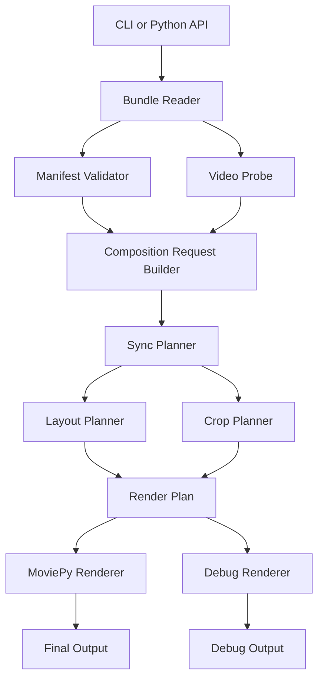

# Maido Architecture

## 1. Purpose

`maido` is a Python library and CLI for packaging annotated video inputs and composing them into a single synchronized output video.

The main use case is:

- accept 2 or more videos
- associate each video with user-supplied metadata
- align all videos around a mandatory sync point
- crop and resize them automatically
- display them simultaneously in one output
- preserve only the core video's audio by default

This project is intended to be usable:

- as a local CLI tool
- as a Python library
- later as a worker/service component behind a web API

---

## 2. Product Model

`maido` is a **core-video-anchored compositor**.

This is not a symmetric "all videos are equal" design.

Every composition has:

- exactly one **core** video
- one or more **supporting** videos

The core video defines:

- the authoritative output timeline
- the reference sync moment
- the default output duration
- the preserved audio track by default

All supporting videos must adapt themselves to the core timeline.

---

## 3. Architectural Goals

### Functional goals
- support 2+ videos in one composition
- require a sync point for every source
- support optional crop center hint
- support optional minimum visible dimensions hint
- support optional maximum visible dimensions hint
- support optional preferred placement direction
- provide a debug rendering mode to visualize metadata assumptions
- package video + metadata together for portability
- keep the core video timeline authoritative

### Non-functional goals
- keep the first-party implementation small and understandable
- avoid `typing`-heavy and `pydantic`-based design
- be safe for CLI and future web API usage
- fail clearly on invalid metadata
- keep the format stable and easy to validate manually
- treat all archives and media as untrusted input

### Non-goals for v1
- automatic sync detection
- full NLE/video-editor behavior
- GUI-first workflow
- advanced multi-track audio mixing
- heuristic placement magic that hides conflicts

---

## 4. Major Design Decisions

| Topic | Decision | Why |
|---|---|---|
| Video composition engine | `moviepy` | Required by project and practical for Python |
| Decoder/backend assumption | `ffmpeg` via MoviePy | Realistic deployment boundary |
| Manifest format | JSON | Safer and simpler than YAML |
| Packaging format | zip bundle | Keeps video + metadata together |
| Bundle manifest filename | `maido.json` | Stable and product-specific |
| Bundle extension | `.maido.zip` | Communicates purpose clearly |
| Validation approach | explicit plain-Python validation | Matches project preference against Pydantic/type-heavy design |
| Timeline model | core-referenced | Matches real product behavior |
| Audio model | core audio only by default | Predictable and simple |
| Debug workflow | separate debug command | Keeps normal composition clean |

---

## 5. Core Video Rule

Every composition must designate exactly one input as the `core` video.

The core video is the timing and audio reference for the final output.

Implications:

- the final output timeline is anchored to the core video
- the core video's sync point defines the reference sync moment
- supporting videos are shifted and trimmed to align to the core sync moment
- the output duration is derived from the core video by default
- only the core audio is preserved by default

This is a deliberate asymmetric design.  
The system must not treat all inputs as equally authoritative.

---

## 6. Recommended Bundle Format

Each source video should be packaged as a self-contained bundle:

- one video file
- one manifest file

Recommended structure:

```text
clip_name.maido.zip
├── maido.json
└── source.mp4
```

### Why zip
Pros:
- single artifact for upload, storage, and CLI use
- keeps metadata attached to the video
- fits future API workflows well

Cons:
- requires safe extraction rules
- creates archive attack surface
- slightly less transparent than a plain folder

### Recommendation
Use zip as the canonical transport format, but keep the internal architecture flexible enough that a plain directory bundle could be supported later.

---

## 7. High-Level System Overview



---

## 8. Module Boundaries

Recommended modules:

- `bundle`
  - packing, reading, archive safety
- `manifest`
  - parse and validate JSON manifests
- `probe`
  - inspect video duration, dimensions, fps
- `sync`
  - align supporting clips to the core timeline
- `layout`
  - assign output cells and directional placement
- `crop`
  - compute crop windows
- `render`
  - apply MoviePy composition
- `debug`
  - generate overlays and debug renders
- `cli`
  - user-facing commands and argument parsing
- `security`
  - shared safety checks and limits

Each module should stay narrowly focused.

---

## 9. Core Components

### 9.1 Bundle Reader
Responsibilities:
- open zip or directory input
- verify archive entries
- locate manifest and video
- safely expose bundle contents for probe/render

Outputs:
- manifest dictionary
- safe temp path or file handle to video
- bundle metadata

### 9.2 Manifest Validator
Responsibilities:
- parse JSON
- validate required and optional fields
- normalize simple defaults
- reject incomplete or conflicting metadata

Examples:
- `sync_point_seconds` is mandatory
- if `min_dimensions` is present, at least one of `width` or `height` must be present
- if `max_dimensions` is present, at least one of `width` or `height` must be present
- `preferred_direction` must be `left`, `right`, `up`, or `down`

### 9.3 Video Probe
Responsibilities:
- inspect duration
- inspect resolution
- inspect fps if needed
- verify manifest values against actual video properties

Examples:
- sync point must not exceed duration
- center must be within frame bounds
- min dimensions must fit inside source bounds

### 9.4 Sync Planner
Responsibilities:
- align all supporting videos to the core video's sync point
- compute per-clip output offsets relative to the core timeline
- determine when black fill is needed before or after a supporting clip
- trim supporting clips when their sync point occurs later than the core sync point

Definitions:
- `core_sync_time`: sync point in the core video
- `clip_sync_time`: sync point in a supporting video

For a supporting clip:
- if `clip_sync_time < core_sync_time`
  - the clip starts later in the output
  - the reserved cell remains black until the clip begins
  - an optional short fade-in may be applied when the clip appears
- if `clip_sync_time > core_sync_time`
  - the clip is trimmed at the start
  - enough leading material is removed so its sync point aligns with the core sync moment

Default output duration:
- start at core time `0`
- end at core video duration

This makes the core timeline authoritative and predictable.

### 9.5 Layout Planner
Responsibilities:
- determine where each clip appears in the output
- honor optional directional placement rules
- choose a stable layout for N videos

Recommended defaults:
- 2 videos: side-by-side horizontal
- 3–4 videos: compact grid
- 5+ videos: stable grid

`preferred_direction` behavior:
- `left`: prefer left-most slot
- `right`: prefer right-most slot
- `up`: prefer top-most slot
- `down`: prefer bottom-most slot

If multiple clips demand incompatible exclusive positions, the planner should fail clearly rather than guess.

### 9.6 Crop Planner
Responsibilities:
- choose the visible crop window for each clip
- use `center` if provided
- preserve minimum visible dimensions where possible
- enforce maximum visible dimensions where requested
- keep crop inside source bounds
- work relative to the clip's assigned output cell

Recommended crop approach:
1. determine target cell size/aspect ratio
2. start with source frame size
3. center crop around user hint if present, otherwise source center
4. preserve `min_dimensions` where possible
5. enforce `max_dimensions` where possible
6. clamp to source boundaries
7. fail if constraints are impossible

### 9.7 Renderer
Responsibilities:
- trim and position each clip according to the composition plan
- apply crop and resize
- fill empty supporting regions with black where video is not present
- render the final output on the core timeline

Audio policy for v1:
- default: preserve only core audio
- optional: mute all audio
- optional: replace with a user-provided external audio file

The renderer should not mix audio from multiple source videos in v1.

### 9.8 Debug Renderer
Responsibilities:
- render a visual explanation of one bundle or a full composition

Recommended overlays:
- sync point marker
- center crosshair
- min-dimensions rectangle
- chosen crop rectangle
- source resolution label
- preferred direction label
- placement label
- timing indicator relative to sync point

---

## 10. Timeline Semantics

The timeline is anchored to the core video.

Rules:
- output time `0` corresponds to core video time `0`
- the core sync point defines the reference sync moment
- each supporting clip is shifted so its sync point lands on the same output time as the core sync point
- if a supporting clip begins later than output time `0`, its area remains black until it appears
- if a supporting clip needs earlier content than it contains, it is trimmed at the start
- if a supporting clip ends before the core timeline ends, its region becomes black for the remainder

Optional polish:
- delayed supporting clips may receive a short fade-in
- fade behavior should remain simple and deterministic

---

## 11. Audio Semantics

Audio is composition-level policy.

Supported v1 modes:
- `core`
  - preserve only the core video's audio
- `mute`
  - output no audio
- `file`
  - replace output audio with a user-supplied external track

Supporting clip audio is ignored in v1.

---

## 12. Proposed CLI Surface

### Bundle workflow
Create, inspect, and package a bundle.

Recommended commands:
- `maido bundle init`
- `maido bundle pack`
- `maido bundle inspect`

### Debug workflow
Render a single annotated bundle.

Recommended command:
- `maido debug input.maido.zip --output debug.mp4`

### Compose workflow
Compose multiple bundles into one output.

Recommended command:
- `maido compose a.maido.zip b.maido.zip c.maido.zip --core 0 --output combined.mp4`

Useful options:
- `--layout auto|horizontal|grid`
- `--audio core|mute|file`
- `--audio-file path/to/audio.mp3`
- `--debug`
- `--entry-fade-seconds 0.15`

Recommendation:
Use an explicit `--core` flag even if the first input is commonly treated as core. Explicitness reduces ambiguity.

---

## 13. Security Assessment

## 13.1 Zip archive risk
Zip files do not execute code by themselves, but they are dangerous if handled unsafely.

Main risks:
- path traversal
- absolute path extraction
- symlink entries
- zip bombs
- unexpected extra files
- overwriting files outside temp space

Required mitigations:
- reject `..`
- reject absolute paths
- reject drive-letter paths
- reject symlinks
- allow only expected files
- limit compressed and uncompressed sizes
- extract only into a private temp directory
- never execute anything from the bundle

## 13.2 JSON risk
JSON does not execute code by itself.

Recommendation:
- use standard safe JSON parsing
- validate every field explicitly
- do not support YAML in v1

## 13.3 Video risk
Video files are the biggest practical risk.

Main issues:
- malformed media may exploit decoder bugs
- huge files may exhaust memory, CPU, or disk
- extreme durations/resolutions/fps may break processing

Required mitigations:
- probe before rendering
- enforce maximum duration, dimensions, fps, and file-size policies
- avoid shell interpolation
- run future API workloads in low-privilege isolated workers
- clean temp files aggressively

---

## 14. Recommended Delivery Phases

### Phase 1: Data contract and bundling
Deliver:
- manifest format
- bundle reader
- archive safety checks
- CLI for init/pack/inspect

### Phase 2: Planning engine
Deliver:
- video probe
- core-referenced sync planner
- layout planner
- crop planner

### Phase 3: Rendering
Deliver:
- composition renderer
- core-audio policy
- mute/external-audio option

### Phase 4: Debugging support
Deliver:
- single-bundle debug preview
- composition debug overlays

### Phase 5: Hardening
Deliver:
- stronger error surfaces
- resource limits
- service-readiness notes
- malformed-input regression tests

---

## 15. First Release Recommendation

Canonical v1 direction:
- use `.maido.zip` bundles
- use `maido.json` manifest
- choose one explicit core input per composition
- anchor the output to the core timeline
- preserve only core audio by default
- use JSON, not YAML
- use explicit validation and plain Python data structures
- treat all inputs as untrusted
